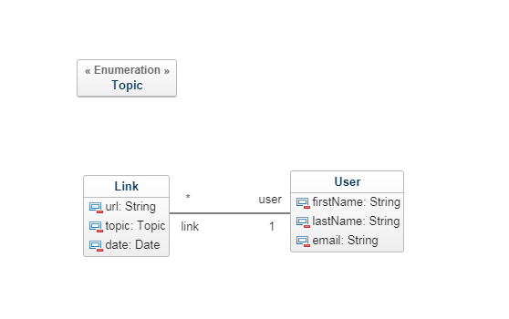

# Atelier promo Java P20

## But du live coding

Créer une application qui permet de faire un calendrier de l'avent pour geek. On veut pouvoir enregistrer des liens ==> un(plusieurs) lien(s) par jour pour tous les visiteurs de l'application.

On veut pouvoir utiliser une application web pour :

- Avoir une page d'accueil où chaque visiteur voit un lien du jour
- Lister les liens créés par un utilisateur
- Ajouter un lien grâce à un formulaire

## Développer une API REST Spring

### Modèle

### Etapes

- Configuration
  - Création du projet (H2, Web, JPA)
  - Configuration d'une base H2
- Développer ses entités
  - Gestion des clés primaires
  - Gestion des attributs
  - Gestion des relations (OneToOne, OneToMany, ManyToMany)
- Développer ses repositories
  - Etendre JPARepository
  - Développer des fonctions spécifiques
- Développer ses services
  - Interface service
  - Implémentation service
- Développer ses controllers
  - RequestMapping
  - Reponses

## Développer une interface simple en Angular

